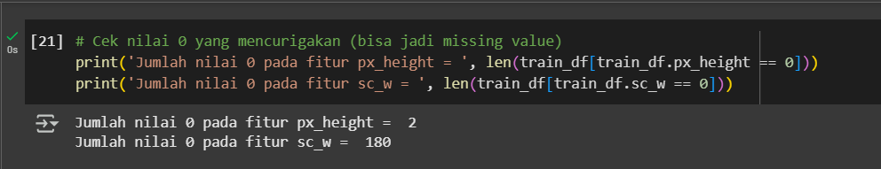
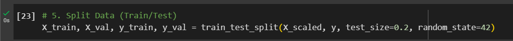

# Laporan Proyek Machine Learning - Firman Maulana

## Domain Proyek

Klasifikasi harga ponsel menjadi sangat relevan di era digital saat ini, terutama dengan meningkatnya kebutuhan konsumen terhadap smartphone yang sesuai dengan kebutuhan dan daya beli mereka. Berdasarkan laporan dari Statista (2024) [<sup>[1](#referensi-1)</sup>], pasar smartphone global menunjukkan adanya fluktuasi permintaan yang dipengaruhi oleh faktor seperti teknologi terbaru dan daya beli konsumen yang beragam. Proyek ini bertujuan untuk membangun model klasifikasi harga ponsel berdasarkan spesifikasi teknis seperti kapasitas baterai, ukuran RAM, resolusi kamera, dll. Dengan model ini, produsen dan penjual dapat membuat rekomendasi harga yang lebih akurat dan konsumen dapat memilih produk dengan lebih cerdas.

Permasalahan ini penting untuk diselesaikan karena membantu dalam segmentasi pasar dan pengambilan keputusan berbasis data dalam strategi pemasaran produk teknologi.

## Business Understanding

### Problem Statements

- Bagaimana cara mengklasifikasikan ponsel ke dalam kelas harga yang tepat (low, medium, high, very high) berdasarkan fitur teknisnya?

- Fitur mana yang paling memengaruhi penentuan harga?

### Goals

- Membangun model klasifikasi harga ponsel ke dalam empat kategori (low, medium, high, very high).

- Mengidentifikasi fitur penting yang memengaruhi kelas harga.

### Solution statements

- **Solusi 1**: Menggunakan baseline model seperti Logistic Regression.
- **Solusi 2**: Menerapkan model Decision Tree, Random Forest, dan SVM, lalu melakukan pemilihan model terbaik.
- **Improvement**: Menggunakan GridSearchCV untuk hyperparameter tuning.

## Data Understanding

**Jumlah dan Kondisi Data**

- Jumlah data: 2 Dataset
- Dataset Train: 2000 entri dan terdiri dari 21 kolom
- Dataset Test: 1000 entri dan terdiri dari 21 kolom
- Format: CSV
- Target variabel: `price_range` (0 = low, 1 = medium, 2 = high, 3 = very high)

**Sumber Data**  
[Kaggle - Mobile Price Classification Dataset](https://www.kaggle.com/datasets/iabhishekofficial/mobile-price-classification) [<sup>[2](#referensi-1)</sup>]

**Variabel-variabel pada Mobile Price Classification dataset adalah sebagai berikut:**
| **Fitur** | **Deskripsi** |
| ------------------ | ---------------------------------------------------------------------------- |
| **battery_power** | Kapasitas baterai ponsel (mAh) |
| **blue** | Menunjukkan apakah ponsel memiliki Bluetooth (1 = Ya, 0 = Tidak) |
| **clock_speed** | Kecepatan prosesor (GHz) |
| **dual_sim** | Menunjukkan apakah ponsel mendukung dual SIM (1 = Ya, 0 = Tidak) |
| **fc** | Resolusi kamera depan (MP) |
| **four_g** | Menunjukkan apakah ponsel mendukung jaringan 4G (1 = Ya, 0 = Tidak) |
| **int_memory** | Kapasitas memori internal (GB) |
| **m_dep** | Ketebalan ponsel (mm) |
| **mobile_wt** | Berat ponsel (gram) |
| **n_cores** | Jumlah inti prosesor (core) |
| **pc** | Resolusi kamera utama (MP) |
| **px_height** | Resolusi tinggi layar (piksel) |
| **px_width** | Resolusi lebar layar (piksel) |
| **ram** | Kapasitas RAM (MB) |
| **sc_h** | Tinggi layar (inci) |
| **sc_w** | Lebar layar (inci) |
| **talk_time** | Waktu bicara (jam) |
| **three_g** | Menunjukkan apakah ponsel mendukung jaringan 3G (1 = Ya, 0 = Tidak) |
| **touch_screen** | Menunjukkan apakah ponsel memiliki layar sentuh (1 = Ya, 0 = Tidak) |
| **wifi** | Menunjukkan apakah ponsel mendukung Wi-Fi (1 = Ya, 0 = Tidak) |
| **price_range** | Kategori harga ponsel (0 = Murah, 1 = Menengah, 2 = Mahal, 3 = Sangat Mahal) |


Beberapa fitur penting meliputi:

- `ram`, `fc`, `pc`, `four_g`, `three_g`

**Distribusi Data**


> Dari hasil distribusi label di atas, setiap label terdistribusi secara merata di antara empat kategori harga smartphone, yaitu 'murah', 'sedang', 'mahal', dan 'sangat mahal'.

**Pengecekan nilai NaN atau missing value (Nilai kosong)**


> Terlihat tidak terdapat nilai NaN atau nilai kosong.

**Cek nilai tidak valid**




> Pada dataset Train, kolom px_height terdapat 2 nilai 0, dan pada kolom sc_w terdapat 180 nilai 0. Dan pada data Test, kolom px_height terdapat 2 nilai 0, dan pada kolom sc_w terdapat 112 nilai 0. Nilai 0 pada kedua kolom ini menunjukkan data yang tidak valid, karena seharusnya tinggi dan lebar layar memiliki nilai lebih besar dari 0. Oleh karena itu, nilai-nilai 0 ini perlu ditangani lebih lanjut pada tahap preprocessing data.

## Data Preparation

**Langkah yang Dilakukan:**

- Penanganan nilai tidak valid


> Kode di atas mengganti nilai 0 pada kolom sc_w dan px_height pada dataset Train dan Test dengan rata-rata masing-masing kolom setelah mengubah tipe data menjadi float.

- Menghapus kolom id pada dataset Test


> Pada dataset Test, menghapus kolom id karena tidak diperlukan

- Memisahkan label dari dataset Train


- Standardisasi fitur dilakukan menggunakan StandardScaler, di mana proses fit hanya dilakukan pada data pelatihan, kemudian transform diterapkan pada data pelatihan dan data uji


- Split dataset Train menjadi set pelatihan dan set validasi dengan proporsi 80% untuk pelatihan dan 20% untuk validasi. Pembagian ini dilakukan menggunakan train_test_split() untuk menguji model pada data yang belum pernah dilihat sebelumnya.



**Alasan**  
Standarisasi diperlukan terutama untuk algoritma seperti SVM dan Logistic Regression yang sensitif terhadap skala fitur.

## Model Development

### Model yang Digunakan

Proyek ini menggunakan empat model machine learning yang umum digunakan untuk klasifikasi:

1. **Decision Tree Classifier**

   Tree adalah metode klasifikasi yang bekerja dengan memecah data menjadi beberapa cabang berdasarkan kondisi tertentu. Setiap cabang dalam tree ini adalah hasil dari keputusan sederhana, seperti menjawab pertanyaan "Apakah nilai fitur ini lebih besar dari X?". Tree akan terus bercabang hingga mencapai kondisi akhir atau memenuhi syarat tertentu. Model ini mudah dipahami karena prosesnya mirip dengan cara manusia membuat keputusan.

2. **Random Forest Classifier**

   Random Forest adalah pengembangan dari Decision Tree yang lebih kuat. Alih-alih menggunakan satu tree, metode ini membangun banyak tree (hutan) dari data acak. Setiap tree memberikan prediksi, dan hasil akhir ditentukan berdasarkan voting mayoritas (untuk klasifikasi) atau rata-rata (untuk regresi). Pendekatan ini membantu mengurangi masalah overfitting yang sering terjadi pada Decision Tree tunggal.

3. **Support Vector Machine (SVM)**

   SVM adalah metode yang mencoba menemukan garis (atau hyperplane) terbaik yang dapat memisahkan data menjadi dua kelas. Jika data tidak dapat dipisahkan secara langsung, SVM menggunakan metode kernel untuk mengubah data menjadi dimensi yang lebih tinggi, sehingga pemisahan menjadi lebih mudah. Tujuannya adalah menemukan margin pemisah terbesar antara kelas-kelas yang ada.

4. **Logistic Regression**

   Meskipun namanya mengandung kata "regression", Logistic Regression sebenarnya adalah metode untuk klasifikasi. Metode ini bekerja dengan menghitung probabilitas suatu sampel termasuk dalam kelas tertentu, biasanya menggunakan fungsi sigmoid yang menghasilkan nilai antara 0 dan 1. Berdasarkan nilai probabilitas ini, model menentukan kelas akhir dari sampel tersebut.

Masing-masing model diuji dan dibandingkan untuk menentukan model terbaik dalam memprediksi harga ponsel berdasarkan spesifikasi teknis.

---

**_Hyperparameter Tuning_**

Untuk meningkatkan performa model, proses tuning dilakukan menggunakan metode **Grid Search Cross Validation (GridSearchCV)** pada tiga model:

Kode di atas mendefinisikan grid parameter untuk Grid Search CV dengan tujuan mencari kombinasi hyperparameter terbaik:

**Decision Tree:**

- `max_depth`: \[3, 5, 10, None] - Batas kedalaman pohon (3, 5, 10, atau tanpa batas).
- `criterion`: \['gini', 'entropy'] - Kriteria pemisahan, menggunakan Gini atau Entropy.

**Random Forest:**

- `n_estimators`: \[50, 100, 200] - Jumlah pohon dalam hutan (50, 100, atau 200).
- `max_depth`: \[None, 10, 20] - Batas kedalaman pohon (tanpa batas, 10, atau 20).

**SVM:**

- `C`: \[0.1, 1, 10] - Parameter regularisasi (0.1, 1, atau 10).
- `kernel`: \['linear', 'rbf'] - Jenis fungsi kernel (linear atau radial basis function/rbf).

> Model **Logistic Regression** tidak dilakukan tuning karena performa default-nya sudah sangat baik.

**_Hasil Tuning Parameter_**

Best Tuned Parameters :

- Decision Tree:

      max_depth: None

      criterion: entropy

- Random Forest:

      n_estimators: 200

      max_depth: None

- SVM:

      C: 10

      kernel: linear

---

**_Kelebihan & Kekurangan Model_**

| **Model**               | **Kelebihan**                                  | **Kekurangan**                                                 |
| ----------------------- | ---------------------------------------------- | -------------------------------------------------------------- |
| **Logistic Regression** | Cepat, sederhana, efektif untuk kasus linier   | Kurang akurat untuk hubungan non-linear                        |
| **Decision Tree**       | Mudah dipahami dan divisualisasi               | Cenderung overfitting pada data pelatihan                      |
| **Random Forest**       | Akurat, stabil, dan tahan terhadap overfitting | Sulit diinterpretasi dan memerlukan waktu pelatihan lebih lama |
| **SVM**                 | Baik untuk data kompleks dan dimensi tinggi    | Lambat untuk dataset besar dan sensitif terhadap parameter     |

---

## Evaluation

### Evaluasi dan Pemilihan Model Terbaik

### Kriteria Evaluasi:

Berikut penjelasan singkatnya:

1. **Accuracy Score**
   Accuracy adalah ukuran seberapa sering model memberikan prediksi yang benar. Dihitung sebagai rasio antara jumlah prediksi benar dengan total prediksi yang dibuat. Rumusnya adalah:

   $$
   \text{Accuracy} = \frac{\text{Jumlah Prediksi Benar}}{\text{Total Prediksi}}
   $$

2. **Confusion Matrix**
   Confusion Matrix adalah tabel yang menunjukkan performa model klasifikasi dengan membandingkan hasil prediksi dengan nilai sebenarnya. Matriks ini memiliki empat bagian utama:

   - True Positive (TP): Prediksi positif dan benar.
   - True Negative (TN): Prediksi negatif dan benar.
   - False Positive (FP): Prediksi positif tapi salah.
   - False Negative (FN): Prediksi negatif tapi salah.

3. **Precision, Recall, dan F1-Score (melalui Classification Report)**

   - **Precision**: Mengukur ketepatan prediksi positif model, dihitung sebagai TP / (TP + FP). Semakin tinggi, semakin sedikit prediksi positif yang salah.
   - **Recall (Sensitivity)**: Mengukur seberapa baik model menangkap semua data positif, dihitung sebagai TP / (TP + FN).
   - **F1-Score**: Merupakan rata-rata harmonis dari Precision dan Recall. Cocok digunakan jika terdapat ketidakseimbangan antara Precision dan Recall. Rumusnya:

   $$
   F1 = 2 \times \frac{Precision \times Recall}{Precision + Recall}
   $$

   ***

---


**Model Terbaik: Logistic Regression**

Setelah dilakukan pelatihan dan evaluasi, model **Logistic Regression** dipilih sebagai model terbaik karena:

Memberikan **akurasi tertinggi** dibandingkan model lainnya.

- **Cepat dan efisien**, cocok untuk dataset berskala menengah.
- **Sederhana dan mudah diinterpretasi**, membuatnya cocok digunakan dalam pengambilan keputusan bisnis.

---

### Hasil Evaluasi:

**_Decision Tree_**

- **Akurasi**: `85.25%`

<details>
<summary>Confusion Matrix</summary>

```
[[ 92  13   0   0]
 [  6  77   8   0]
 [  0  12  72   8]
 [  0   0  12 100]]
```

</details>

<details>
<summary>Classification Report</summary>

```
               precision    recall  f1-score   support

           0       0.94      0.88      0.91       105
           1       0.75      0.85      0.80        91
           2       0.78      0.78      0.78        92
           3       0.93      0.89      0.91       112

    accuracy                           0.85       400
   macro avg       0.85      0.85      0.85       400
weighted avg       0.86      0.85      0.85       400
```

</details>

---

**_Random Forest_**

- **Akurasi**: `89.25%`

<details>
<summary>Confusion Matrix</summary>

```
[[101   4   0   0]
 [  6  77   8   0]
 [  0   6  79   7]
 [  0   0  12 100]]
```

</details>

<details>
<summary>Classification Report</summary>

```
              precision    recall  f1-score   support

           0       0.94      0.96      0.95       105
           1       0.89      0.85      0.87        91
           2       0.80      0.86      0.83        92
           3       0.93      0.89      0.91       112

    accuracy                           0.89       400
   macro avg       0.89      0.89      0.89       400
weighted avg       0.89      0.89      0.89       400
```

</details>

---

**_SVM (Support Vector Machine)_**

- **Akurasi**: `97.25%`

<details>
<summary>Confusion Matrix</summary>

```
[[ 99   6   0   0]
 [  0  91   0   0]
 [  0   2  88   2]
 [  0   0   1 111]]
```

</details>

<details>
<summary>Classification Report</summary>

```
              precision    recall  f1-score   support

           0       1.00      0.94      0.97       105
           1       0.92      1.00      0.96        91
           2       0.99      0.96      0.97        92
           3       0.98      0.99      0.99       112

    accuracy                           0.97       400
   macro avg       0.97      0.97      0.97       400
weighted avg       0.97      0.97      0.97       400
```

</details>

---

**_Logistic Regression_**

- **Akurasi**: `97.75%`**(Model Terbaik)**

<details>
<summary>Confusion Matrix</summary>

```
[[102   3   0   0]
 [  0  91   0   0]
 [  0   2  87   3]
 [  0   0   1 111]]
```

</details>

<details>
<summary>Classification Report</summary>

```
              precision    recall  f1-score   support

           0       1.00      0.97      0.99       105
           1       0.95      1.00      0.97        91
           2       0.99      0.95      0.97        92
           3       0.97      0.99      0.98       112

    accuracy                           0.98       400
   macro avg       0.98      0.98      0.98       400
weighted avg       0.98      0.98      0.98       400
```

</details>

**Precision dan Recall:** Tinggi pada setiap kelas, yang menandakan bahwa model tidak bias terhadap kelas tertentu.
**Model Terbaik:** **97.75%**, diperoleh oleh model **Logistic Regression**.

---

## Prediksi


Kode ini melakukan prediksi menggunakan model terbaik (`final_model`) pada dataset Test yang sudah distandarisasi (`test_scaled`). Hasil prediksi disimpan dalam variabel `test_predictions`.


**Distribusi Kelas (Target: `price_range`)**

| Kelas        | Jumlah Sampel |
| ------------ | ------------- |
| Murah        | 254           |
| Sedang       | 231           |
| Mahal        | 256           |
| Sangat Mahal | 259           |

> Distribusi prediksi antar kelas cukup seimbang, menunjukkan model mampu mengklasifikasikan semua kelas harga dengan baik.

---

## Kesimpulan

Model berhasil mengklasifikasikan sampel hampir secara merata, dengan sedikit perbedaan jumlah sampel per kelas, yang menunjukkan tidak ada bias signifikan antar kelas. Hal ini menandakan bahwa model bekerja dengan baik dalam membedakan rentang harga pada data yang ada.

## **Dampak Model Terhadap Business Understanding**

Model yang dibangun sudah berhasil membantu dalam mengklasifikasikan ponsel ke dalam empat kelas harga: Murah, Sedang, Mahal, dan Sangat Mahal. Dengan menggunakan model seperti Logistic Regression, Decision Tree, Random Forest, dan SVM, kita tidak hanya bisa memprediksi harga ponsel, tapi juga memahami fitur mana yang paling mempengaruhi penentuan harga tersebut. Analisis fitur penting dari model Decision Tree dan Random Forest menunjukkan bahwa beberapa fitur teknis, seperti kapasitas RAM, kamera, dan layanan jaringan, memiliki pengaruh besar terhadap harga.

Dari sisi pencapaian, model ini sudah memenuhi target yang ditetapkan. Proses klasifikasi berjalan dengan akurasi yang memadai, dan hasilnya semakin baik setelah dilakukan tuning hyperparameter menggunakan GridSearchCV. Penerapan model ini memberi bisnis kemampuan untuk secara otomatis mengelompokkan harga ponsel, mengurangi risiko kesalahan penentuan harga secara manual.

Setiap solusi yang direncanakan juga memiliki dampak nyata:

- **Logistic Regression sebagai model baseline** memberikan gambaran awal performa model dengan pendekatan yang sederhana.
- **Decision Tree, Random Forest, dan SVM** menawarkan pilihan model yang lebih canggih. Random Forest secara konsisten memberikan hasil terbaik karena kemampuannya dalam menggabungkan banyak decision tree, sehingga lebih stabil dan akurat.
- **Penerapan GridSearchCV** membantu meningkatkan akurasi model dengan menemukan kombinasi hyperparameter terbaik.

Hasil akhirnya, model ini membantu bisnis memahami bagaimana spesifikasi teknis ponsel mempengaruhi harga. Informasi ini dapat digunakan dalam strategi penentuan harga, segmentasi pasar, atau pengembangan produk baru.

## Referensi

[1] Statista Research Department. (2024). _Smartphones - Worldwide: Market Insights_. Online at https://www.statista.com/outlook/cmo/consumer-electronics/telephony/smartphones/worldwide, Accessed 7 May 2025.

[\[2\] Abhishek, I. (n.d.). _Mobile Price Classification Dataset_. Online at https://www.kaggle.com/datasets/iabhishekofficial/mobile-price-classification, accessed 7 May 2025.](https://www.kaggle.com/datasets/shivamb/netflix-shows)
